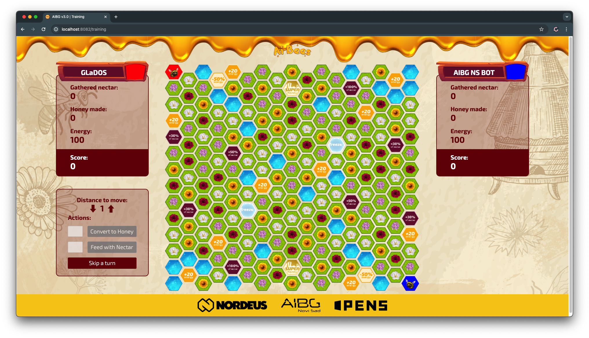

# BeesBot

Welcome to **BeesBot**, the ultimate bot designed to win the Bees Game by applying strategic decision-making and optimization with the minimax algorithm. This project was developed during the AIBG3.0 Hackathon within a 20-hour timeframe, and it aims to maximize points by intelligently managing resources, actions, and tiles in the Bees Game.

  

## Game Overview

In the Bees Game, players control a bee with the following key metrics:

- **Gathered Nectar**: The amount of nectar in the bee (maximum 100).
- **Honey Made**: Honey produced in the hive by converting nectar (1 honey = 20 nectar).
- **Energy**: The energy available to the bee (minimum 1, with 1 nectar providing 2 energy).
- **Score**: The total points earned by a player.

Players navigate across different tiles, gather resources, and perform various actions to accumulate points. The game can end under several conditions, including reaching 500 turns, depleting resources, exceeding the maximum allowed skips, or reaching a critical state with energy or other penalties.

## BeesBot Strategy

BeesBot uses the **minimax algorithm** to optimize its gameplay strategy by simulating possible outcomes and choosing the most favorable actions. Here's how it operates:

- **Energy Management**: BeesBot calculates the most efficient way to move across tiles while maintaining energy levels.
- **Nectar Collection**: The bot optimizes gathering nectar from different tiles (CHERRY_BLOSSOM, LILAC, ROSE, SUNFLOWER) and uses boosters to increase nectar collection.
- **Honey Production**: By converting nectar to honey, BeesBot earns significant points. It strategically balances energy use and honey production.
- **Tile Interaction**: The bot makes optimal use of special tiles (e.g., HIVE, POND, BOOSTER_NECTAR_30_PCT, BOOSTER_NECTAR_50_PCT, SUPER_HONEY) to maximize points.
- **Endgame Strategy**: BeesBot is designed to adapt to endgame conditions, aiming to outscore opponents based on remaining resources and final outcomes.

## Authors

- Olivera Radovanović - [GitHub](https://github.com/Olivera2708)
- Miloš Bojanić - [GitHub](https://github.com/milosbojanic)
- Marko Mitošević - [GitHub](https://github.com/markomitos)
